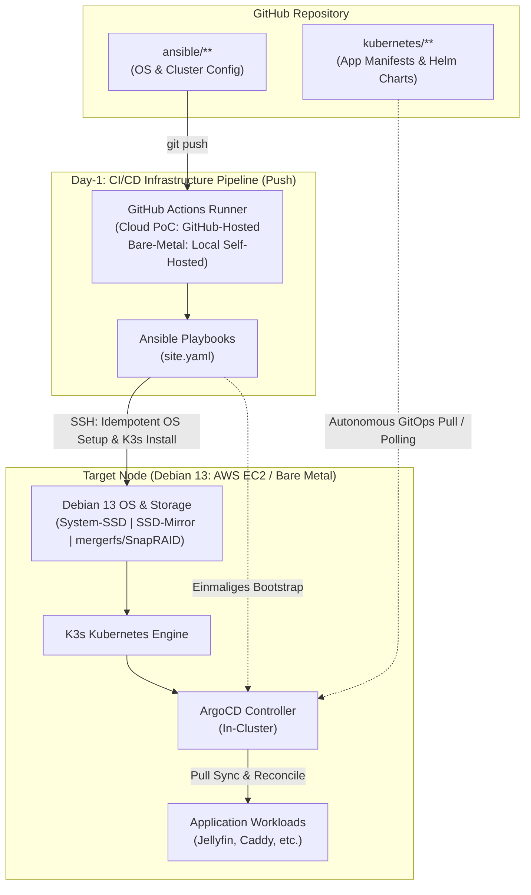

# Cloud-to-Bare-Metal: K3s Infrastructure & Homelab Migration

This repository contains the end-to-end blueprint and automated implementation for migrating a legacy **Unraid homelab server** to a modern, fully declarative **K3s Kubernetes cluster** running on **Debian 13 (Trixie)**.

To eliminate migration risks and guarantee zero downtime for production data, the entire architecture is developed and validated first in an **ephemeral AWS cloud testbed (Terraform + Ansible)** before being deployed onto physical bare-metal hardware (`mergerfs` + `SnapRAID`, SSD mirror pools, and ArgoCD).

---

## 🗺️ Migration Roadmap & Phases

The migration is structured into 8 core phases plus a dedicated pre-cutover testing gate (Phase 7.5), moving systematically from cloud validation to bare-metal cutover:

| Phase | Milestone | Focus / Tech Stack | Status |
| :--- | :--- | :--- | :--- |
| **Phase 1** | **AWS PoC Infrastructure** | Ephemeral testbed via Terraform, EC2, EBS & dynamic SSH config | ✅ Done |
| **Phase 2** | **Ansible Baseline Setup** | Declarative OS hardening, base packages & PoC volume mounts | ✅ Done |
| **Phase 3** | **K3s Bootstrap & Runtime** | K3s installation, local-path storage to app storage & test workload | 🏁 In Progress |
| **Phase 4** | **GitOps & CI/CD (GitHub Actions)** | Push-based Ansible Day-1 automation, linting & clean rebuild test | ⏳ Planned |
| **Phase 5** | **Bare-Metal Foundation** | Physical hardware, System-SSD, SSD-Mirror, `mergerfs`/`SnapRAID` & local runner | ⏳ Planned |
| **Phase 6** | **K3s Native GitOps (ArgoCD)** | In-cluster ArgoCD deployment, repo integration & pull-based workload sync | ⏳ Planned |
| **Phase 7** | **Day-2 Operations & Security** | Automated SnapRAID sync/scrub timers, K3s state backup & restic appdata backup | ⏳ Planned |
| **Phase 7.5** | **Pre-Migration Gate & Resilience** | App-by-app rehearsal, backup restore test, SnapRAID recovery & rollback verification | ⏳ Planned |
| **Phase 8** | **Data Migration & Unraid Cutover** | Container appdata & media `rsync`, ArgoCD prod sync, DNS cutover & decommissioning | ⏳ Planned |

---

## Architecture at a Glance

* **Infrastructure Provisioning (Phase 1 & 5):** Cloud testbeds managed via **Terraform** on AWS; bare-metal target initialized via a dedicated base Debian 13 installation on the system SSD.
* **OS Baseline & 3-Tier Storage (Phase 2 & 5):** Configured declaratively via **Ansible**:
  * **System-SSD:** Dedicated Debian OS and boot drive.
  * **Appdata-SSD-Mirror:** Hardware/ZFS mirror pool for latency-sensitive K3s Persistent Volumes (local-path provisioner).
  * **Bulk Storage Pool (`mergerfs` + `SnapRAID`):** **In-place migration** of existing Unraid data HDDs **without reformatting**, pooled into a unified filesystem with parity protection.
* **Separation of Concerns (Day-1 vs. Day-2):**
  * **Day-1 Bootstrapping (Phase 3 & 4):** **Ansible** (executed via GitHub Actions) handles exclusively OS configuration, storage mounts, K3s installation, and one-time ArgoCD bootstrapping.
  * **Day-2 Application Lifecycle (Phase 6):** **ArgoCD** runs natively inside the K3s cluster, using a pure **pull-based GitOps engine** to reconcile manifests and Helm charts from Git. GitHub Actions never touches container deployments directly.
* **Bare-Metal Portability:** By isolating OS configuration and Kubernetes deployment into Ansible, the entire provisioning workflow runs identically on physical bare-metal nodes once Debian is installed.

---

## Deployment Targets & Multi-Platform Strategy

The infrastructure and provisioning workflow is strictly platform-agnostic, separating infrastructure declaration from application orchestration:

| Layer | AWS Cloud PoC (`eu-central-1`) | RemoteLab (Hyper-V Hypervisor) | Bare-Metal Target (Homelab) |
| :--- | :--- | :--- | :--- |
| **Purpose** | IaC validation, cloud networking, ephemeral PoC | Staging, load testing, migration rehearsal | Production runtime environment |
| **Compute** | EC2 (`t3.micro` for base tests, `t3.large` for full load) | Debian Gen2 VM (dedicated vCPUs, dynamic RAM) | Physical Debian 13 node |
| **Storage** | AWS EBS (`gp3`, 10 GB PoC) | Virtual Hard Disk (`.vhdx`, dynamically sized) | **3-Tier Storage:**<br>1. System SSD (OS)<br>2. SSD-Mirror (Appdata/K3s PVCs)<br>3. `mergerfs` + `SnapRAID` HDD pool (In-Place Unraid Disks) |
| **Provisioning** | Terraform + Ansible | Hyper-V Host / PowerShell + Ansible | ISO / Cloud-Init + Ansible |
| **Cost Profile** | Pay-as-you-go (~0.08 $/hr for load testing) | Zero marginal cost (continuous runtime) | Fixed local hardware cost |

### Orchestration Principle
Ansible plays and roles target the abstract OS layer (`Debian 13`). Whether executed against an AWS EC2 instance via the generated `ssh_config`, a VM in the RemoteLab, or physical bare metal, the provisioning baseline, storage mounts, and K3s bootstrap remain idempotent and reproducible.

---

## GitOps & CI/CD Pipeline (Day-1 vs. Day-2)

The architecture strictly decouples **infrastructure bootstrapping (Day-1)** from **workload management (Day-2)**:



### 1. Day-1 Bootstrapping vs. Day-2 GitOps (Separation of Concerns)
* **Day-1: Infrastructure & Cluster Bootstrapping (Ansible / CI/CD Push):**
  * The GitHub Actions runner acts as an ephemeral Ansible Control Node.
  * It enforces desired system state idempotently: OS hardening, disk mounts (`mergerfs`, `SnapRAID`, SSD mirror), kernel parameters, K3s installation, and one-time bootstrapping of ArgoCD.
  * **GitHub Actions never pushes application containers or modifies runtime Kubernetes workloads directly.**
* **Day-2: Application Lifecycle & Workloads (ArgoCD / GitOps Pull):**
  * ArgoCD runs as an autonomous reconciliation controller inside the K3s cluster.
  * It monitors the `kubernetes/**` directory in Git and continuously pulls/reconciles the desired application state against the K3s API.
  * External runners do not need cluster access or exported `kubeconfig` files to deploy applications.

### 2. Secret & Credential Management
Security adheres to the **Principle of Least Privilege (PoLP)**:
* **Cloud PoC:** Target node SSH credentials (`SSH_PRIVATE_KEY`) are passed via GitHub Repository Secrets (injected from 1Password) into memory via `webfactory/ssh-agent@v0.9.0`. No keys persist on runner disks.
* **Bare-Metal Production:** To avoid exposing internal SSH keys to cloud runners, execution switches to a **local self-hosted GitHub Actions runner** running as an isolated container inside the homelab LAN.

### 3. Workflow Triggers & Pipeline Stages
* **Triggers:**
  * `push` to `main` restricted strictly to changes within `ansible/**`.
  * `workflow_dispatch` for manual dry-runs and parameter-driven deployments.
* **Pipeline Stages:**
  1. **Validation & Linting:** `ansible-lint` and YAML validation against best practices.
  2. **Dry Run / Diff:** `ansible-playbook -i inventory --check --diff` to preview state drifts.
  3. **Playbook Execution:** `ansible-playbook -i <inventory> site.yaml` to enforce the target infrastructure state.

### 4. Transition to Bare-Metal Homelab
* **Air-Gapped Credential Boundary:** Using a self-hosted runner inside the local network completely eliminates the need for inbound SSH port forwardings or storing physical server credentials in the cloud.
* **Inventory Switching:** Changing environments only requires selecting the corresponding Ansible inventory group (`aws_poc` vs. `bare_metal`), keeping all underlying roles and playbooks identical.

---

## Repository Structure

```text
.
├── README.md               # Project entry point and high-level overview
├── docs/                   # Modular architecture and technical documentation
│   ├── terraform.md        # Detailed guide for AWS provisioning & lifecycle
│   └── ansible.md          # OS baseline, storage orchestration & dual-stack K3s rollout
├── terraform/
│   └── aws-poc/            # Infrastructure-as-Code definitions (VPC, EC2, EBS)
└── ansible/                # Playbooks, roles, and inventory (in progress)
```

---

## Detailed Documentation

* [Terraform AWS Provisioning & Lifecycle Guide](docs/terraform.md)
* [Ansible Configuration & K3s Provisioning Guide](docs/ansible.md)
* Architecture Decisions & Network Topology (`docs/architecture.md` - coming soon)

---

## Quickstart

### Prerequisites

* AWS CLI installed and configured (`~/.aws/credentials`, configured with `[homelab]` profile by default)
* Terraform >= 1.5.0
* Ansible >= 2.15.0
* Dedicated SSH key pair (default: `~/.ssh/id_ed25519_aws_poc.pub`)

### Run the PoC Cycle

1. **Provision Infrastructure (Phase 1):**
   ```bash
   cd terraform/aws-poc
   terraform init
   terraform apply
   ```

2. **Access the Node:**
   ```bash
   ssh -F ssh_config aws-k3s-poc
   ```

3. **Provision OS Baseline, Storage & K3s (Phase 2 & 3):**
   ```bash
   cd ../../ansible
   ansible-playbook -i inventory/hosts.yaml site.yaml
   ```

4. **Teardown & Cleanup:**
   To avoid ongoing cloud costs when finished testing:
   ```bash
   cd ../terraform/aws-poc
   terraform destroy
   ```

---

## License

Distributed under the [MIT License](LICENSE).