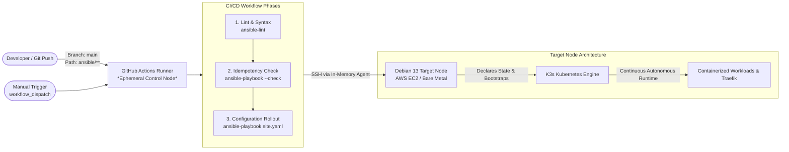

# Cloud-to-Bare-Metal: K3s Infrastructure & Homelab Migration

This repository contains the end-to-end blueprint and automated implementation for migrating a legacy **Unraid homelab server** to a modern, fully declarative **K3s Kubernetes cluster** running on **Debian 13 (Trixie)**.

To eliminate migration risks and guarantee zero downtime for production data, the entire architecture is developed and validated first in an **ephemeral AWS cloud testbed (Terraform + Ansible)** before being deployed onto physical bare-metal hardware (`mergerfs` + `SnapRAID`, SSD mirror pools, and ArgoCD).

---

## 🗺️ Migration Roadmap & Phases

The migration is structured into 8 distinct phases, moving systematically from cloud validation to bare-metal cutover:

| Phase | Milestone | Focus / Tech Stack | Status |
| :--- | :--- | :--- | :--- |
| **Phase 1** | **AWS PoC Infrastructure** | Ephemeral testbed via Terraform & dynamic SSH config | ✅ Done |
| **Phase 2** | **Ansible Baseline & Storage** | Declarative OS hardening, base packages & PoC volume mounts | 🔄 In Progress |
| **Phase 3** | **K3s Bootstrap & Runtime** | Automated K3s cluster deployment, local-path storage & ingress | ⏳ Planned |
| **Phase 4** | **CI/CD & Ephemeral Control Node** | GitHub Actions runner as push-based Ansible Control Node | ⏳ Planned |
| **Phase 5** | **Bare-Metal Foundation** | Physical hardware setup, SSD mirrors, `mergerfs` & `SnapRAID` | ⏳ Planned |
| **Phase 6** | **Native GitOps Engine** | Pull-based application lifecycle & manifests via ArgoCD | ⏳ Planned |
| **Phase 7** | **Day-2 Operations & Security** | Automated SnapRAID sync/scrub, etcd/SQLite & appdata backups | ⏳ Planned |
| **Phase 8** | **Data Migration & Cutover** | Final `rsync` migration from Unraid, DNS cutover & decommissioning | ⏳ Planned |

---

## Architecture at a Glance

* **Infrastructure Provisioning (Phase 1 & 5):** Cloud testbeds managed via **Terraform** on AWS; bare-metal target provisioned via base Debian installation and dedicated storage pools.
* **OS Baseline & Storage Configuration (Phase 2 & 5):** Managed declaratively via **Ansible** (storage formatting, mounting, OS hardening, base dependencies, MergerFS/SnapRAID).
* **Cluster Bootstrap & Runtime Orchestration (Phase 3 & 6):** Deployed via **Ansible** and managed autonomously at runtime by **K3s** and **ArgoCD** (declarative GitOps for container workloads, Traefik ingress, Helm charts).
* **Bare-Metal Portability:** By isolating operating system configuration and Kubernetes deployment into Ansible, the entire provisioning workflow runs identically on physical bare-metal nodes once Debian is installed.

---

## Deployment Targets & Multi-Platform Strategy

The infrastructure and provisioning workflow is strictly platform-agnostic, separating infrastructure declaration from application orchestration:

| Layer | AWS Cloud PoC (`eu-central-1`) | RemoteLab (Hyper-V Hypervisor) | Bare-Metal Target (Homelab) |
| :--- | :--- | :--- | :--- |
| **Purpose** | IaC validation, cloud networking, ephemeral PoC | Staging, load testing, migration rehearsal | Production runtime environment |
| **Compute** | EC2 (`t3.micro` for base tests, `t3.large` for full load) | Debian Gen2 VM (dedicated vCPUs, dynamic RAM) | Physical Debian 13 node |
| **Storage** | AWS EBS (`gp3`, 10 GB PoC) | Virtual Hard Disk (`.vhdx`, dynamically sized) | Dedicated NVMe / SATA SSD pools |
| **Provisioning** | Terraform + Ansible | Hyper-V Host / PowerShell + Ansible | ISO / Cloud-Init + Ansible |
| **Cost Profile** | Pay-as-you-go (~0.08 $/hr for load testing) | Zero marginal cost (continuous runtime) | Fixed local hardware cost |

### Orchestration Principle
Ansible plays and roles target the abstract OS layer (`Debian 13`). Whether executed against an AWS EC2 instance via the generated `ssh_config`, a VM in the RemoteLab, or physical bare metal, the provisioning baseline, storage mounts, and K3s bootstrap remain idempotent and reproducible.

---

## GitOps & CI/CD Pipeline (GitHub Actions)

To transition from local execution to declarative GitOps, the **Ansible Control Node** is migrated into a GitHub Actions CI/CD pipeline.



### 1. Architecture & Ephemeral Control Node
* **Push-based GitOps:** The GitHub Actions runner acts as a disposable, ephemeral Ansible Control Node. Changes pushed to the repository automatically trigger the desired configuration state against the target host.
* **Separation of Concerns:**
  * **Ansible (Declarative Configuration):** Enforces desired system state idempotently (OS hardening, disk partitioning/mounting, kernel parameters, K3s installation, baseline manifests).
  * **K3s (Autonomous Runtime):** Manages continuous container lifecycle, self-healing, health probes, service discovery, and Traefik ingress routing independently of CI/CD runtime.

### 2. Secret- & Key-Management
Security adheres to the **Principle of Least Privilege (PoLP)** without persisting credentials on runners:
* **In-Memory SSH Agent:** Target node SSH credentials (`SSH_PRIVATE_KEY`) are stored as encrypted GitHub Repository Secrets (or injected dynamically via 1Password Service Account Action) and loaded exclusively into memory during runner execution via `webfactory/ssh-agent@v0.9.0`.
* **Zero Disk Persistence:** No private keys or long-lived authentication tokens are written to runner storage. Host keys are strictly checked or passed via parameterized SSH known_hosts injection.

### 3. Workflow Triggers & Execution Stages
* **Triggers:**
  * `push` to `main` (restricted to changes within `ansible/**`).
  * `workflow_dispatch` for manual dry-runs and parameter-driven deployments.
* **Pipeline Stages:**
  1. **Validation & Linting:** Executes `ansible-lint` and YAML validation to verify playbooks and roles against best practices.
  2. **Dry Run / Diff (Optional):** Runs `ansible-playbook -i inventory --check --diff` to preview state deviations before rollout.
  3. **Playbook Execution:** Executes `ansible-playbook -i <inventory> site.yaml` to enforce the target state.

### 4. Transition to Bare-Metal Homelab
The GitOps pipeline is architected to transition seamlessly from the AWS cloud PoC to local physical hardware:
* **Networking & Reachability:** Targets behind residential NAT/firewalls can be reached securely without open ingress ports via:
  * **Mesh VPN Overlay (e.g., Tailscale / WireGuard):** Ephemeral GitHub runner connects to the Tailscale tailnet before executing Ansible.
  * **Self-Hosted Runner:** Running an isolated GitHub Actions runner directly within the homelab DMZ/LAN.
* **Inventory Switching:** Changing environments only requires selecting the corresponding Ansible inventory group (`aws_poc` vs. `bare_metal`), keeping all underlying playbooks identical.

---

## Repository Structure

```text
.
├── README.md               # Project entry point and high-level overview
├── docs/                   # Modular architecture and technical documentation
│   ├── terraform.md        # Detailed guide for AWS provisioning & lifecycle
│   └── ansible.md          # OS hardening, storage mounts, and K3s rollout (planned)
├── terraform/
│   └── aws-poc/            # Infrastructure-as-Code definitions (VPC, EC2, EBS)
└── ansible/                # Playbooks, roles, and inventory (in progress)
```

---

## Detailed Documentation

* [Terraform AWS Provisioning & Lifecycle Guide](docs/terraform.md)
* Architecture Decisions & Network Topology (`docs/architecture.md` - coming soon)
* Ansible Configuration & Storage Orchestration (`docs/ansible.md` - coming soon)

---

## Quickstart

### Prerequisites

* AWS CLI installed and configured (`~/.aws/credentials`)
* Terraform >= 1.5.0
* Dedicated SSH key pair (default: `~/.ssh/id_ed25519_aws_homelab.pub`)

### Run the PoC Cycle

1. **Provision Infrastructure (Phase 1):**
   ```bash
   cd terraform/aws-poc
   terraform init
   terraform apply
   ```

2. **Access the Node:**
   ```bash
   ssh -F ssh_config aws-k3s-poc
   ```

3. **Teardown & Cleanup:**
   To avoid ongoing cloud costs when finished testing:
   ```bash
   terraform destroy
   ```

---

## License

Distributed under the [MIT License](LICENSE).