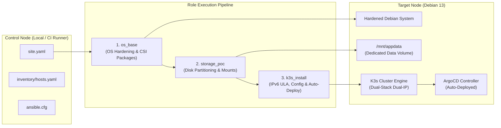
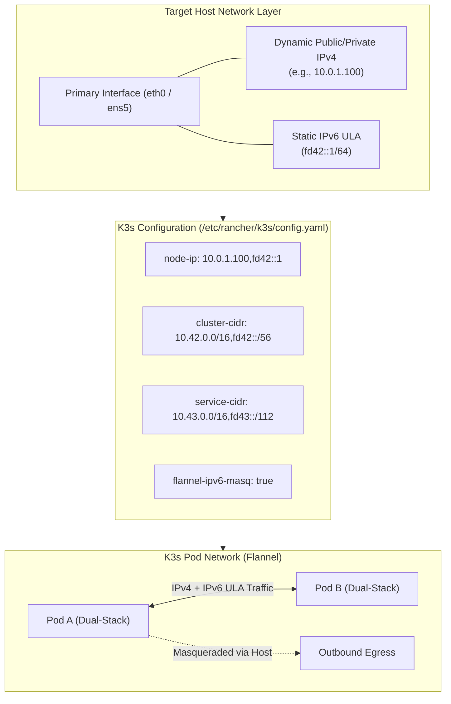
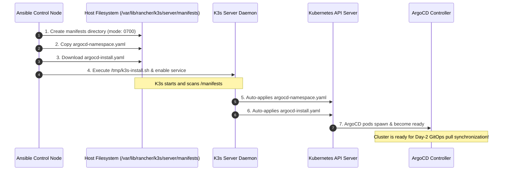

# Ansible Infrastructure & K3s Provisioning Documentation

This document details the configuration management, storage provisioning, networking topology, and cluster bootstrapping implemented via **Ansible** (`ansible/`) for the K3s Homelab Migration project.

---

## 1. Orchestration Architecture & Workflow

The Ansible setup automates the **Day-1 provisioning** of the target node, transforming a freshly installed Debian 13 (Trixie) system into a fully functional, dual-stack K3s Kubernetes host with an autonomous GitOps engine.



### Configuration Files

* **`ansible.cfg`:**
  * `inventory = ./inventory/hosts.yaml`: Default inventory location.
  * `roles_path = ./roles`: Modular role directory.
  * `host_key_checking = False`: Prevents interactive SSH host-key prompts on newly provisioned cloud instances.
  * `stdout_callback = debug`: Provides structured, human-readable console output.
  * `pipelining = True`: Reuses SSH connections and executes Python tasks in memory, drastically reducing network overhead.
* **`inventory/hosts.yaml`:**
  * Group `k3s_cluster` containing host `aws-k3s-poc`.
  * Integrates directly with Terraform via `ansible_ssh_common_args: '-F ../terraform/aws-poc/ssh_config'`, routing SSH traffic through the dynamically generated OpenSSH configuration.
* **`site.yaml`:**
  * Root playbook applying roles sequentially with elevated privileges (`become: true`):
    1. `os_base`
    2. `storage_poc`
    3. `k3s_install`

---

## 2. OS Baseline & System Dependencies (`roles/os_base`)

The `os_base` role enforces system-level hygiene and installs prerequisites required by Kubernetes storage drivers:

* **Package Updates (`apt`):**
  * Runs `update_cache: yes` and `upgrade: dist` to ensure all distribution packages and security patches are current.
  * Uses `cache_valid_time: 3600` to prevent redundant repository updates within a 1-hour window.
* **System Utilities:** Installs `curl`, `git`, `htop`, and `jq` for operational debugging and script execution.
* **Storage Prerequisites:**
  * `open-iscsi`: Kernel userspace tools for iSCSI block storage.
  * `nfs-common`: Kernel clients and RPC services required by Kubernetes CSI drivers to mount persistent NFS shares.

---

## 3. Storage Orchestration & The "Fliegender Wechsel" Strategy (`roles/storage_poc`)

Storage management is handled by `roles/storage_poc`. The role decouples application data from the root operating system disk by creating and mounting a dedicated block storage volume.

### Current Implementation (AWS Cloud PoC)

1. **Filesystem Creation (`community.general.filesystem`):**
   * Formats `/dev/nvme1n1` (the attached AWS EBS `gp3` volume) with an `ext4` filesystem.
2. **Mount Point Provisioning (`ansible.builtin.file`):**
   * Creates `/mnt/appdata` with permissions `0755`.
3. **Persistent Mounting (`ansible.posix.mount`):**
   * Mounts `/dev/nvme1n1` to `/mnt/appdata` and registers the entry in `/etc/fstab` (`state: mounted`) for persistence across reboots.

### ⚠️ The "Fliegender Wechsel" to Bare-Metal (Phase 5)

> [!IMPORTANT]
> In the current **AWS PoC**, creating a fresh `ext4` filesystem (`community.general.filesystem`) on every deployment is intentional: it ensures complete idempotency and tests raw disk provisioning from scratch.
>
> In **Phase 5 (Bare-Metal Production Migration)**, this role will undergo a **seamless, non-destructive transformation ("Fliegender Wechsel")**:
> * **Zero Data Loss Guarantee:** Physical Unraid data drives already contain terabytes of media, documents, and historical data formatted in `xfs` or `ext4`. Executing formatting tasks would result in catastrophic data destruction.
> * **Transformation into Pure Mount Tasks:** In Phase 5, all disk-formatting tasks will be eliminated. The role will be refactored into:
>   1. Mounting existing disks by stable filesystem UUIDs (`/dev/disk/by-uuid/...`).
>   2. Creating a unified, transparent storage pool using **`mergerfs`** (JBOD union filesystem across legacy Unraid drives).
>   3. Initializing parity protection via **`SnapRAID`**.
>   4. Mounting the dedicated NVMe SSD mirror pool for high-performance application persistent volumes at `/mnt/appdata`.
>
> This guarantees that existing Unraid disks are integrated into the new Debian/K3s system in-place without copying or reformatting.

---

## 4. K3s Architecture & The IPv6 Island-Setup (`roles/k3s_install`)

To prepare the cluster for modern dual-stack Kubernetes networking while running inside an IPv4-only cloud VPC, the deployment implements an **IPv6 Island-Setup**.



### 1. Dynamic Host ULA Allocation

The AWS VPC does not allocate public IPv6 prefixes to compute subnets. To satisfy Kubernetes dual-stack requirements without requiring cloud-provider IPv6 infrastructure, Ansible dynamically assigns an RFC 4193 **Unique Local Address (ULA)** to the host's primary network interface:

```yaml
- name: Ensure Node has an IPv6 ULA assigned to its primary interface (Island-Setup)
  ansible.builtin.command:
    cmd: "ip -6 addr add fd42::1/64 dev {{ ansible_facts['default_ipv4']['interface'] }}"
  register: ipv6_add
  failed_when: 
    - ipv6_add.rc != 0
    - "'File exists' not in ipv6_add.stderr"
    - "'address already assigned' not in ipv6_add.stderr"
  changed_when: ipv6_add.rc == 0
```

* **Dynamic Interface Discovery:** Uses Ansible facts (`ansible_facts['default_ipv4']['interface']`) to detect the default interface (`eth0`, `ens5`, etc.) regardless of hardware naming.
* **Idempotency:** Gracefully handles existing assignments by evaluating `stderr` for `File exists` or `address already assigned`.

### 2. Flannel IPv6 Masquerading (`flannel-ipv6-masq: true`)

Because the allocated ULA range (`fd42::/56`) is non-routable on the external AWS network, K3s must ensure internal IPv6 pod traffic is translated when communicating across host boundaries or egressing:

* **Dual-Stack CIDR Allocation:**
  * Pod network (`cluster-cidr`): `10.42.0.0/16` (IPv4) and `fd42::/56` (IPv6).
  * Service network (`service-cidr`): `10.43.0.0/16` (IPv4) and `fd43::/112` (IPv6).
* **`flannel-ipv6-masq: true`:** Instructs the Flannel CNI plugin to inject `ip6tables` NAT rules, masquerading outbound IPv6 pod traffic behind the host's assigned ULA address. This allows internal dual-stack communication without dropping packets at the host interface.

---

## 5. Declarative Configuration: Single Source of Truth (`/etc/rancher/k3s/config.yaml`)

Rather than configuring K3s via imperatively passed CLI flags (`INSTALL_K3S_EXEC` environment variables) or systemd service drop-in files, all node parameters are declared centrally in `/etc/rancher/k3s/config.yaml`.

```yaml
# Dual-Stack: IPv4 (10.42.x.x) / IPv6 ULAs (fd42::)
cluster-cidr: "10.42.0.0/16,fd42::/56"
service-cidr: "10.43.0.0/16,fd43::/112"
flannel-ipv6-masq: true

# Force the node to use both IPs (dynamic IPv4 + static ULA) using modern facts syntax
node-ip: "{{ ansible_facts['default_ipv4']['address'] }},fd42::1"

# Storage: Dedicated path for Persistent Volumes
default-local-storage-path: "/mnt/appdata"
```

### Architectural Advantages

1. **Auditability & Reproducibility:** Every cluster runtime option is version-controlled and rendered declaratively before the installation binary executes.
2. **Upgrade Resilience:** Changes persist across K3s binary upgrades and system restarts without risking systemd unit override overwrites.
3. **Multi-IP Node Registration (`node-ip`):** Binds the node simultaneously to the dynamically discovered public/private IPv4 address (`{{ ansible_facts['default_ipv4']['address'] }}`) and the static IPv6 ULA (`fd42::1`).
4. **Storage Redirection (`default-local-storage-path`):** By default, K3s's embedded `local-path-provisioner` writes persistent volume data to `/var/lib/rancher/k3s/storage` on the root disk. Setting this parameter redirects all container storage volumes directly to `/mnt/appdata`, ensuring application workloads utilize the dedicated data volume.

---

## 6. Zero-Touch GitOps: ArgoCD Bootstrap (`/var/lib/rancher/k3s/server/manifests`)

To maintain a strict boundary between **Day-1 infrastructure provisioning** (Ansible) and **Day-2 application reconciliation** (ArgoCD), the playbook leverages K3s's built-in **Auto-Deploy Manifest Controller**.



### Mechanics of the Auto-Deploy Directory

K3s continuously monitors `/var/lib/rancher/k3s/server/manifests` using an internal controller. Any standard Kubernetes manifest placed into this folder is automatically applied to the cluster upon startup.

1. **Secure Directory Creation:** Creates `/var/lib/rancher/k3s/server/manifests` with strict permissions (`0700`, owner `root:root`) to protect cluster credentials and manifest integrity.
2. **Namespace Declaration (`argocd-namespace.yaml`):** Declares the target `argocd` namespace.
3. **Official Controller Installation (`argocd-install.yaml`):** Downloads the latest stable release manifest directly from the official ArgoCD repository (`argoproj/argo-cd`).
4. **Autonomous Reconciliation:** When K3s boots, its internal controller applies the manifests in alphabetical order. ArgoCD controllers, CRDs, and API servers deploy without needing:
   * External `kubectl apply` commands.
   * Exporting `kubeconfig` to CI/CD runners.
   * Installing Kubernetes Python libraries (`kubernetes`, `PyYAML`) on the Ansible control node.

Once ArgoCD is running, all subsequent application deployments (Traefik ingress routes, Jellyfin, Nextcloud, monitoring) are handled exclusively via GitOps pull requests against the `kubernetes/` repository path.

---

## 7. Execution Guide & Verification

### Running the Playbook

Execute the deployment from the `ansible/` directory using the generated Terraform SSH configuration:

```bash
# 1. Syntax check
ansible-playbook -i inventory/hosts.yaml site.yaml --syntax-check

# 2. Dry run / Check mode
ansible-playbook -i inventory/hosts.yaml site.yaml --check --diff

# 3. Apply infrastructure state
ansible-playbook -i inventory/hosts.yaml site.yaml
```

### Verifying Node & Cluster State

SSH into the target host:

```bash
ssh -F ../terraform/aws-poc/ssh_config aws-k3s-poc
```

Verify storage mounts, network addresses, and Kubernetes runtime components:

```bash
# Check dedicated storage mount
df -h /mnt/appdata

# Verify IPv6 ULA assignment
ip -6 addr show dev eth0

# Verify K3s node registration and internal IPs
sudo k3s kubectl get nodes -o wide

# Verify ArgoCD components bootstrapped via auto-deploy
sudo k3s kubectl get pods -n argocd
```
